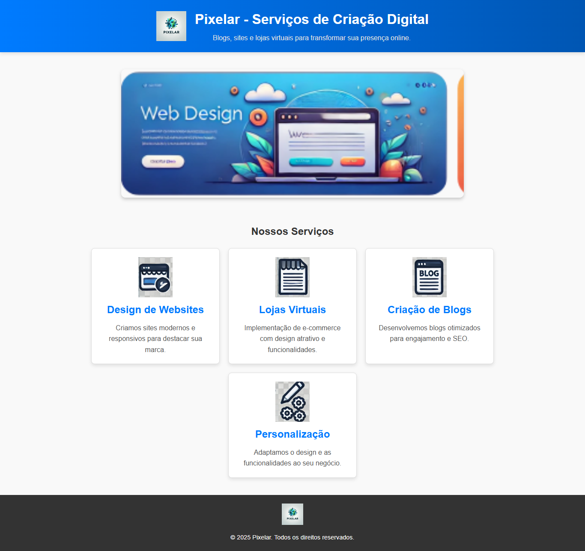

# Pixelar - Serviços Web

Bem-vindo ao repositório do **Pixelar - Serviços Web**! Este projeto é um site estático desenvolvido para promover serviços digitais, incluindo design de websites, criação de blogs, personalização de sistemas e lojas virtuais.


---


## 📸 Captura de Tela

Aqui está uma prévia do site:



> **Nota:** Substitua `images/print-site.png` pelo caminho correto do print no repositório.

---


## 🎯 Funcionalidades

- **Design Moderno:** Sites responsivos e otimizados para dispositivos móveis.
- **E-commerce:** Implementação de lojas virtuais com foco em conversão.
- **Criação de Blogs:** Blogs otimizados para engajamento e SEO.
- **Personalização:** Design e funcionalidades adaptadas ao seu negócio.

---

## 🚀 Como Visualizar o Site

Você pode visualizar o site hospedado em [GitHub Pages](https://seuusuario.github.io/pixelar-servicos-web/). 

---

## 📂 Estrutura do Projeto

```plaintext
📁 projeto/
├── 📄 index.html       # Página principal
├── 📂 images/          # Imagens do projeto
├── 📄 style.css        # Estilo customizado (separado do HTML, opcional)
└── 📄 README.md        # Documentação do projeto

💻 Tecnologias Utilizadas
HTML5
CSS3
🛠️ Como Clonar o Repositório
Clone o repositório:
bash
Copiar código
git clone https://github.com/seuusuario/pixelar-servicos-web.git
Abra o arquivo index.html no navegador para visualizar o site.
🤝 Contribuições
Sinta-se à vontade para abrir issues ou pull requests para melhorar o projeto!

📞 Contato
Para mais informações, entre em contato:

Email: contato@pixelar.com
Telefone: +55 62 99999-9999
Site: Pixelar
© 2025 Pixelar - Todos os direitos reservados.

yaml
Copiar código

---

Deseja criar ou ajustar algo nesse exemplo?


